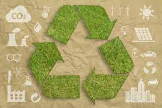

# ¿Cómo podemos garantizar la protección del medio ambiente?
- No dejar encendidos o enchufados los aparatos electrónicos: Televisor, el PC, el cargador del móvil, ya que aunque esten apagados siguen consumiendo energía 
- Apagar las luces: Apagar las luces de las habitaciones que no estamos usando ayuda a reducir el consumo de energía.
- Cuidar el agua y cerra los grifos de manera correcta: usar de manera efiviente el agua con el objetivo de ahorrar. Actualmente la escasez de agua afecta a 4 de cada 10 personas.
- Separar la basura: Es considerada una de las mejores medidas que se pueden llevar a cabo. Separar los cartones y papeles de los plásticos, los envases de vidrio y de plástico, escoger los productos con envases mas pequeños, escoger los productos con origen reciclado, usar bolsas de tela cuando compremos algo.

