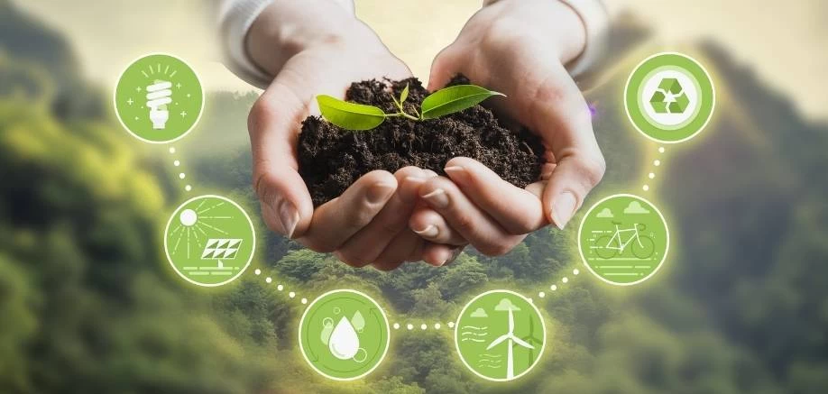

# ¿Cuáles son los objetivos de la protección del medio ambiente?

Alguno de los objetivos son:
- Eliminar de manera segura los residus no valorizados.
- Maximización del compstaje y el reciclado.
- Maximizar el nivel prevención.
- Modernización del manejo y control de la información sobre residuos.
- Incrementar el nivel de reutilización y reciclaje.
- Minimizar el nivel de los rechazos que son destinados a los vertederos.
- Reducir el grado de producción de residuos.

