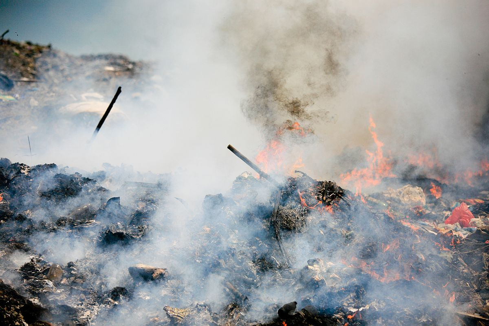
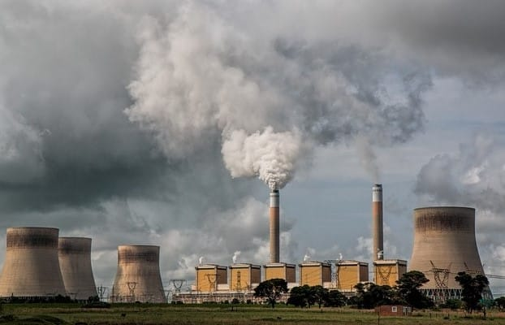

# ¿Cuáles son los riesgos ambientales?
Los riegos ambientales es la posibilidad de que se produzca un daño (o catástrofe) en el medio ambiente provocado por una acción humana o un fenómeno natural. Este es considerado uno de los mayores riesgos evaluados.
Pueden clasificarse en 2:
- Riesgos naturales: Aquellos originados por los fenómenos geológicos internos. Algunos ejemplos pordrían ser inundaciones, volcanes, terremotos, etc.
- Riesgos antrópicos: Aquellos originados por la propia actividad del ser humano, por lo que el grado de gravedad es varible. Algunos ejemplos podrían ser la catástrofe de Chernóbil o el accidente de Bhopal, considerado el peor accidente químico hasta el momento.

